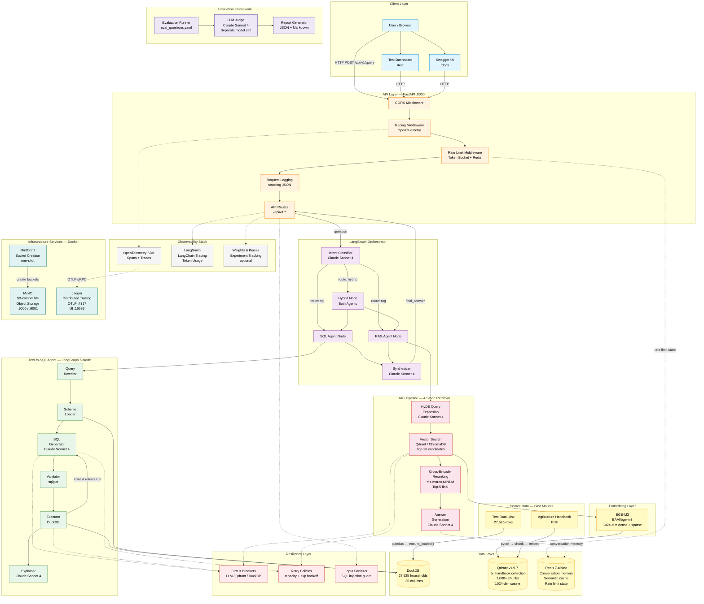
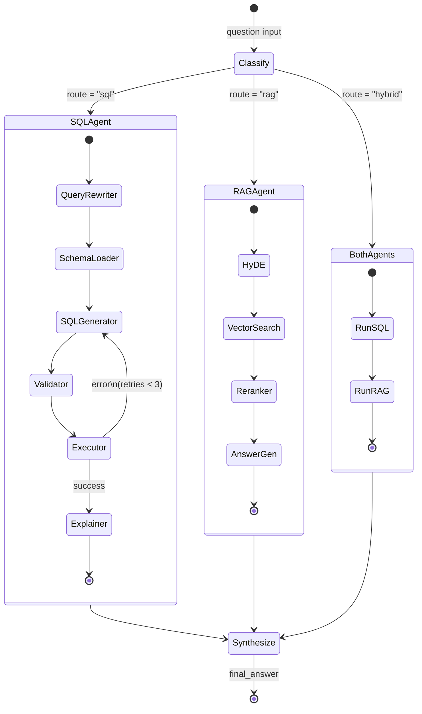
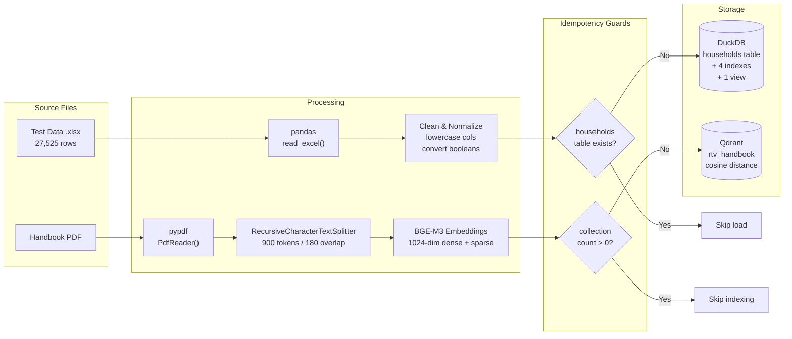
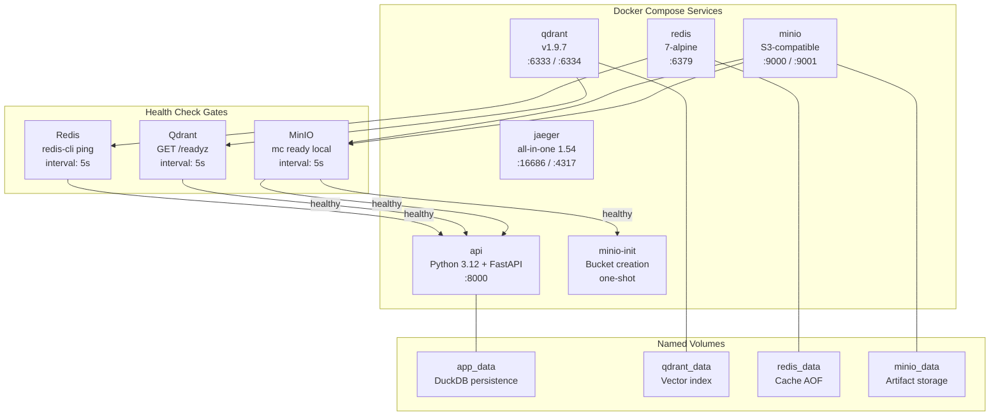
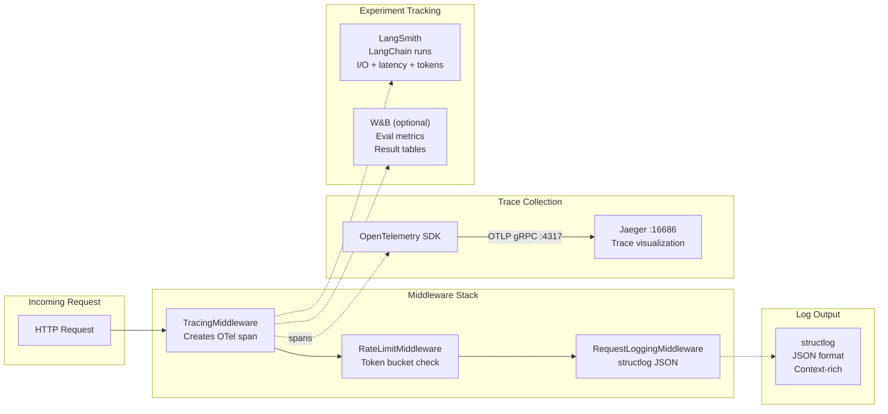

# RTV Multi-Agent ML System — System Architecture Report

**Author:** Jonah Kyagaba
**Date:** March 2026
**Version:** 1.0.0

---

## Table of Contents

1. [Executive Summary](#1-executive-summary)
2. [System Overview](#2-system-overview)
3. [Component Architecture](#3-component-architecture)
4. [Data Architecture](#4-data-architecture)
5. [Infrastructure & Deployment](#5-infrastructure--deployment)
6. [Resilience & Fault Tolerance](#6-resilience--fault-tolerance)
7. [Observability Stack](#7-observability-stack)
8. [Security Architecture](#8-security-architecture)
9. [Evaluation Framework](#9-evaluation-framework)
10. [Performance Characteristics](#10-performance-characteristics)
11. [Design Decisions & Trade-offs](#11-design-decisions--trade-offs)

---

## System Architecture Diagram (Mermaid)

### Full Multi-Agent System Architecture



### Orchestrator State Machine (LangGraph)



### Data Ingestion Flow



### Docker Service Dependency Graph



### Observability & Tracing Flow



---

## 1. Executive Summary

The RTV Multi-Agent ML System is a production-grade AI application that answers natural-language questions about Raising the Village (RTV) household survey data and agricultural best practices in Uganda. It uses two specialized AI agents — a **Text-to-SQL agent** for structured data queries and a **RAG agent** for knowledge-base retrieval — coordinated by a **LangGraph supervisor** that classifies intent and routes queries to the appropriate agent(s).

**Key metrics:**
- **27,525** household records across 4 regions
- **1,000+** document chunks from the Agriculture Handbook
- **3 query modes:** SQL, RAG, and Hybrid (both agents)
- **4 evaluation metrics:** Faithfulness, Answer Relevancy, Context Precision, SQL Correctness
- **6 infrastructure services** in a single Docker Compose deployment

---

## 2. System Overview

### High-Level Request Flow

```
                         ┌─────────────────────┐
                         │    User / Client     │
                         └──────────┬───────────┘
                                    │ HTTP
                         ┌──────────▼───────────┐
                         │   FastAPI Server      │
                         │   ┌───────────────┐   │
                         │   │ Middleware     │   │
                         │   │ - CORS        │   │
                         │   │ - Tracing     │   │
                         │   │ - Rate Limit  │   │
                         │   │ - Logging     │   │
                         │   └───────┬───────┘   │
                         └───────────┼───────────┘
                                     │
                         ┌───────────▼───────────┐
                         │  LangGraph Orchestrator │
                         │  ┌─────────────────┐   │
                         │  │ Intent Classifier│   │
                         │  │ (Claude LLM)     │   │
                         │  └──┬─────┬─────┬──┘   │
                         │     │     │     │       │
                         │  ┌──▼┐ ┌──▼┐ ┌──▼──┐   │
                         │  │SQL│ │RAG│ │Both │   │
                         │  └──┬┘ └──┬┘ └──┬──┘   │
                         │     │     │     │       │
                         │  ┌──▼─────▼─────▼──┐   │
                         │  │   Synthesizer    │   │
                         │  └─────────────────┘   │
                         └────────────────────────┘
                              │             │
               ┌──────────────▼──┐   ┌──────▼───────────┐
               │    DuckDB       │   │   Qdrant          │
               │  (households)   │   │  (handbook chunks) │
               └─────────────────┘   └──────────────────┘
```

### Deployment Topology

```
docker-compose.yml
├── api          (Python 3.12, FastAPI, uvicorn)
├── qdrant       (v1.9.7 — vector search)
├── redis        (7-alpine — caching & memory)
├── minio        (S3-compatible object storage)
├── minio-init   (one-shot bucket creation)
└── jaeger       (1.54 — distributed tracing UI)
```

---

## 3. Component Architecture

### 3.1 Text-to-SQL Agent

**Location:** `src/agents/sql_agent.py`

A 6-node LangGraph state machine that converts natural language to DuckDB SQL:

```
┌──────────────┐    ┌──────────────┐    ┌──────────────┐
│    Query      │───▶│   Schema     │───▶│    SQL       │
│   Rewriter    │    │   Loader     │    │  Generator   │
└──────────────┘    └──────────────┘    └──────┬───────┘
                                               │
                                       ┌───────▼───────┐
                                       │   Validator    │
                                       │  (sqlglot)     │
                                       └───────┬───────┘
                                               │
                         ┌─────────────────────▼───────────────────┐
                         │              Executor                    │
                         │  ┌─────────────────────────────────┐    │
                         │  │ Execute SQL on DuckDB            │    │
                         │  │ If error & retries < 3 → retry  │    │
                         │  └─────────────────────────────────┘    │
                         └─────────────────────┬───────────────────┘
                                               │
                                       ┌───────▼───────┐
                                       │   Explainer    │
                                       │ (LLM summary)  │
                                       └───────────────┘
```

**Key design choices:**
- **Self-correction loop**: On SQL execution errors, the agent retries up to 3 times with error context fed back into the generator.
- **Schema injection**: Full DDL, column descriptions, data quality warnings, and few-shot examples are injected into the prompt (`src/db/schema_context.py`).
- **SQL validation**: `sqlglot` parses and validates SQL before execution, catching syntax errors early.
- **Input sanitization**: User input is sanitized via `src/core/sanitizer.py` to prevent injection.

**Data quality safeguards baked into schema context:**
| Column | Issue | Mitigation |
|--------|-------|------------|
| `farm_implements_owned` | Outlier: max = 30,000 | `farm_implements_clean` view (cap at 100), prompt warns to use MEDIAN |
| `average_water_consumed_per_day` | Units = jerrycans, 0 = missing | Prompt notes units; agent filters zeros |
| `household_id` | String, not integer | Prompt warns never to CAST |
| `land_size_for_crop_agriculture_acres` | max = 99 may mean "unknown" | Prompt warns about sentinel values |

### 3.2 RAG Pipeline

**Location:** `src/rag/pipeline.py`

A 4-stage retrieval-augmented generation pipeline for the Agriculture Handbook:

```
┌───────────────┐    ┌────────────────┐    ┌────────────────┐    ┌───────────────┐
│  HyDE Query    │───▶│  Vector Search  │───▶│  Cross-Encoder │───▶│   Answer      │
│  Expansion     │    │  (Qdrant/Chroma)│    │  Reranking     │    │  Generation   │
└───────────────┘    └────────────────┘    └────────────────┘    └───────────────┘
```

**Stage details:**

| Stage | Component | Parameters |
|-------|-----------|------------|
| **1. Chunking** | `RecursiveCharacterTextSplitter` | 900 tokens, 180 overlap, 6-level separators |
| **2. HyDE** | Claude generates hypothetical answer | 70% hypothetical + 30% original query blend |
| **3. Vector Search** | Qdrant (cosine, 1024-dim BGE-M3) | Top-20 candidates; section metadata filtering |
| **4. Reranking** | `cross-encoder/ms-marco-MiniLM-L-6-v2` | Rescores top-20 → top-5 final |

**Embedding model:** BAAI/bge-m3

| Property | Value |
|----------|-------|
| Dimensions | 1024 |
| Vector types | Dense + Sparse (hybrid) |
| Max sequence length | 512 tokens |
| Similarity metric | Cosine |

**Section-aware retrieval:** The retriever (`src/rag/retriever.py`) maps keywords in the query to handbook sections (Composting, Liquid Manure, Keyhole Gardening, Nursery Bed, Soil & Water Conservation) and applies metadata filters to narrow the search space.

**Vector store selection** (automatic):
```python
if QdrantVectorStore.is_available():   # Docker / production
    return QdrantVectorStore()
else:
    return VectorStore()                # ChromaDB local fallback
```

### 3.3 Orchestrator (LangGraph Supervisor)

**Location:** `src/orchestrator/router.py`

A 5-node LangGraph that classifies intent and routes to the appropriate agent(s):

```
┌──────────┐     ┌───────────┐
│ Classify  │────▶│ sql_agent  │───┐
│ (LLM)    │     └───────────┘    │
│           │     ┌───────────┐    ├──▶ ┌────────────┐
│           │────▶│ rag_agent  │───┤    │ Synthesize  │──▶ END
│           │     └───────────┘    │    └────────────┘
│           │     ┌────────────┐   │
│           │────▶│ both_agents│───┘
└──────────┘     └────────────┘
```

**Intent classification prompt:** The classifier receives descriptions of both data sources (household DB schema summary and handbook topics) and returns one of `sql`, `rag`, or `hybrid`. Defaults to `hybrid` on ambiguous input.

**Synthesis (hybrid mode):** When both agents run, the synthesizer merges their outputs into a coherent answer that attributes each fact to its source.

### 3.4 Evaluation Framework (LLM-as-Judge)

**Location:** `src/evaluation/judge.py`, `src/evaluation/runner.py`

| Metric | Agent | Scoring Method |
|--------|-------|---------------|
| **Faithfulness** | RAG | Is the answer grounded in the retrieved context? (0-1) |
| **Answer Relevancy** | SQL + RAG | Does the answer address the question? (0-1) |
| **Context Precision** | RAG | Are the retrieved chunks relevant to the question? (0-1) |
| **SQL Correctness** | SQL | Valid syntax, matches intent, produces correct results? (0-1) |

**Judge model:** Claude Sonnet 4 — intentionally a separate LLM call from the generation model to avoid self-evaluation bias.

**Benchmark questions:** Defined in `config/eval_questions.yaml` covering both SQL and RAG categories.

---

## 4. Data Architecture

### 4.1 Household Data (DuckDB)

**Source:** `Test Data 2026-03-17-12-43.xlsx` (27,525 rows, ~30 columns)

**Ingestion flow:**
```
Excel File (.xlsx)
    │ pandas.read_excel()
    ▼
DataFrame (cleaning, normalization)
    │ - Lowercase column names
    │ - Convert booleans (cassava, maize, VSLA, etc.)
    │ - Convert timestamps to string
    ▼
DuckDB "households" table
    │ CREATE OR REPLACE TABLE
    ▼
Indexes + Views
    - idx_region, idx_district, idx_prediction, idx_region_pred
    - farm_implements_clean (outlier filter view)
```

**Storage:** `data/rtv_households.duckdb` (persistent file; created on first startup)

**Idempotency:** `ensure_loaded()` checks if the "households" table exists before loading. On subsequent startups the load is skipped.

### 4.2 Agriculture Handbook (Vector Store)

**Source:** `Copy of RTV_IMP_Handbook_*.pdf` (auto-detected via glob)

**Ingestion flow:**
```
Handbook PDF
    │ pypdf.PdfReader()
    ▼
Raw pages (text + page metadata)
    │ RecursiveCharacterTextSplitter
    │ (900 tokens, 180 overlap)
    ▼
~1,000+ chunks with metadata
    │ BGE-M3 embeddings (1024-dim)
    ▼
Qdrant collection "rtv_handbook"
    - Cosine distance
    - On-disk payload storage
```

**Idempotency:** The pipeline checks `vector_store.count()` before re-indexing.

### 4.3 Data Flow at Startup

```
FastAPI lifespan start
    │
    ├─ setup_tracing()              # OpenTelemetry
    ├─ setup_langsmith()            # LangSmith
    │
    ├─ MultiAgentOrchestrator()     # Creates SQL + RAG agents
    │
    ├─ db.ensure_loaded()           # DuckDB ← Excel (if not loaded)
    │   └─ 27,525 rows loaded
    │
    ├─ rag_agent.initialize()       # Vector store ← Handbook (if empty)
    │   └─ ~1,000+ chunks embedded
    │
    └─ LLMJudge()                   # Evaluation judge ready
```

---

## 5. Infrastructure & Deployment

### 5.1 Docker Multi-Stage Build

```dockerfile
# Stage 1: builder
FROM python:3.12-slim AS builder
# Install only core deps (no chromadb, wandb, ragas, FlagEmbedding)
pip install --prefix=/install .

# Stage 2: production
FROM python:3.12-slim AS production
COPY --from=builder /install /usr/local
# Pre-download BGE-M3 at build time (eliminates runtime download)
RUN python -c "from sentence_transformers import SentenceTransformer; SentenceTransformer('BAAI/bge-m3')"
COPY --chown=rtv:rtv . .
```

**Optimization decisions:**
- Heavy optional deps (`chromadb`, `FlagEmbedding`, `unstructured`, `ragas`, `wandb`) moved to `pyproject.toml` optional groups — not installed in Docker.
- BGE-M3 model (~2.4 GB) downloaded at build time, not at runtime — eliminates 3+ minute startup delay.
- `.dockerignore` excludes `.env`, `*.xlsx`, `*.pdf`, `*.docx`, `*.md`, `data/`, `results/` — small build context.
- Data files mounted as read-only volumes in `docker-compose.yml`.

### 5.2 Service Dependency Graph

```
redis ────────┐
qdrant ───────┤ (all must be healthy)
minio ────────┤
              ▼
           api service
              │
minio-init ◄──┘ (one-shot bucket setup)
jaeger         (independent, no dependency)
```

### 5.3 Health Checks

| Service | Check | Interval | Timeout |
|---------|-------|----------|---------|
| API | `GET /api/v1/health` | 15s | 10s |
| Qdrant | `GET /readyz` | 5s | 3s |
| Redis | `redis-cli ping` | 5s | 3s |
| MinIO | `mc ready local` | 5s | 3s |

### 5.4 Volume Strategy

| Volume | Purpose | Type |
|--------|---------|------|
| `app_data` | DuckDB database persistence | Named volume |
| `qdrant_data` | Vector index persistence | Named volume |
| `redis_data` | Cache persistence (AOF) | Named volume |
| `minio_data` | Artifact storage | Named volume |
| Excel/PDF files | Source data for ingestion | Bind mount (read-only) |

---

## 6. Resilience & Fault Tolerance

### 6.1 Circuit Breakers

**Location:** `src/core/circuit_breaker.py`

Three-state circuit breaker (Closed → Open → Half-Open) wraps calls to:
- LLM API (Anthropic)
- Vector database (Qdrant)
- SQL database (DuckDB)

On N consecutive failures the circuit opens, returning graceful fallback responses instead of cascading errors.

### 6.2 Retry Policies

**Location:** `src/core/retry.py`

Uses `tenacity` for configurable retry with exponential backoff on transient failures (network timeouts, rate limits).

### 6.3 Rate Limiting

**Location:** `src/core/rate_limiter.py`

Token-bucket rate limiter with Redis backing. Prevents API abuse and protects downstream LLM API quota.

### 6.4 Self-Correction (SQL Agent)

The SQL agent retries up to 3 times when execution fails, feeding the error message back into the SQL generator for correction.

### 6.5 Graceful Degradation

| Service Down | Behavior |
|-------------|----------|
| Qdrant unavailable | Falls back to ChromaDB (if installed) |
| Redis unavailable | Rate limiting and caching disabled; API still works |
| Handbook PDF missing | RAG queries return warning; SQL queries unaffected |
| W&B / LangSmith unreachable | Observability disabled; core functionality unaffected |

---

## 7. Observability Stack

### 7.1 Three-Pillar Observability

```
┌─────────────────────────────────────────────────────┐
│                  Observability                       │
├──────────────────┬──────────────┬───────────────────┤
│    Tracing       │   Metrics    │    Logging        │
│  OpenTelemetry   │   LangSmith  │   structlog       │
│  + Jaeger UI     │   + W&B      │   (JSON format)   │
│  :16686          │              │                   │
└──────────────────┴──────────────┴───────────────────┘
```

### 7.2 Tracing

- **OpenTelemetry SDK** instruments every request end-to-end.
- **Jaeger** collects traces at `http://localhost:4317` (OTLP gRPC) and provides a UI at `http://localhost:16686`.
- Every LLM call, vector search, and DB query appears as a span in the trace.

### 7.3 Experiment Tracking

- **LangSmith** (`src/core/observability.py`): Traces LangChain/LangGraph runs with input/output pairs, latency, and token usage. Project: `rtv-multi-agent-system`.
- **Weights & Biases** (optional): Logs evaluation metrics, tables of results, and artifact files. Project: `rtv-multi-agent-eval`.

### 7.4 Structured Logging

All modules use Python's `logging` module with `structlog` for JSON-formatted, context-rich log output.

---

## 8. Security Architecture

### 8.1 Input Validation

- **API boundary:** Pydantic models (`src/api/schemas.py`) validate all request payloads.
- **SQL injection prevention:** `src/core/sanitizer.py` sanitizes user input before it reaches the SQL generator. `sqlglot` validates generated SQL before execution.
- **Path traversal:** File paths are resolved against `PROJECT_ROOT` only.

### 8.2 Container Security

- Application runs as non-root user (`rtv`) inside the Docker container.
- Data files are bind-mounted read-only (`:ro`).
- No secrets baked into the image — all credentials via environment variables.

### 8.3 API Security

- CORS middleware configured (currently `allow_origins=["*"]` for development — should be restricted in production).
- Rate limiting middleware prevents abuse.
- No authentication layer yet (recommended for production deployment).

### 8.4 Secret Management

- All API keys (`ANTHROPIC_API_KEY`, `WANDB_API_KEY`, etc.) loaded from `.env` via `pydantic-settings`.
- `.env` is excluded from Docker builds via `.dockerignore` and from git via `.gitignore`.

---

## 9. Evaluation Framework

### 9.1 Evaluation Pipeline

```
config/eval_questions.yaml
    │
    ▼
┌──────────────────┐     ┌─────────────────┐
│  Evaluation       │────▶│  LLM Judge      │
│  Runner           │     │  (Claude Sonnet) │
│  (runner.py)      │     │  (judge.py)      │
└──────────┬───────┘     └─────────────────┘
           │
           ▼
┌──────────────────┐
│  Report Generator │
│  (report.py)      │
│  JSON + Markdown  │
└──────────────────┘
```

### 9.2 Benchmark Categories

| Category | Example Questions |
|----------|-------------------|
| **SQL - Aggregation** | "What is the average predicted income by region?" |
| **SQL - Filtering** | "How many households grow cassava in Eastern region?" |
| **SQL - Comparison** | "Which district has the highest VSLA participation rate?" |
| **RAG - Procedural** | "How do I construct a compost pit?" |
| **RAG - Factual** | "What materials are needed for liquid manure?" |
| **Hybrid** | "What composting methods are recommended for districts with high maize production?" |

### 9.3 Output Artifacts

- `results/latest_eval.json` — machine-readable scores per question
- `results/latest_eval.md` — human-readable report with pass/fail verdicts

---

## 10. Performance Characteristics

### 10.1 Startup Timeline (Docker)

| Phase | Duration | Notes |
|-------|----------|-------|
| Pull base images | ~40s (first time only) | Cached after first pull |
| `pip install` (build stage) | ~180-240s (first build) | Cached unless pyproject.toml changes |
| BGE-M3 download (build stage) | ~120s (first build) | Baked into image, cached on rebuild |
| Infrastructure health checks | ~10-15s | Redis/Qdrant/MinIO startup |
| DuckDB data load | ~2-3s | 27.5K rows from Excel (skipped if already loaded) |
| RAG initialization | ~30-60s | Chunking + embedding ~1,000 chunks (skipped if already indexed) |
| **Total cold start** | **~6-8 min** (first build) | |
| **Subsequent start** | **~15-30s** | Image cached, data persisted in volumes |

### 10.2 Query Latency (Typical)

| Query Type | Latency | Bottleneck |
|-----------|---------|------------|
| SQL query | 2-5s | LLM call (SQL generation + explanation) |
| RAG query | 3-7s | LLM call (HyDE) + vector search + LLM (answer generation) |
| Hybrid query | 5-10s | Both agents run sequentially + synthesis LLM call |
| Health check | <100ms | Local state check |

### 10.3 Resource Usage

| Service | Memory | CPU | Disk |
|---------|--------|-----|------|
| API container | ~2-3 GB | 1 core | ~3 GB (model + deps) |
| Qdrant | ~200 MB | 0.5 core | ~100 MB (1K chunks) |
| Redis | ~256 MB (capped) | 0.1 core | Minimal |
| MinIO | ~200 MB | 0.1 core | Varies with artifacts |
| Jaeger | ~100 MB | 0.1 core | Minimal |

---

## 11. Design Decisions & Trade-offs

### 11.1 Why DuckDB over PostgreSQL?

| Factor | DuckDB | PostgreSQL |
|--------|--------|------------|
| Setup | Zero-config, embedded | Requires server |
| OLAP performance | Column-oriented, fast analytics | Row-oriented, needs tuning |
| Dataset size fit | Perfect for 27K rows | Overkill for this scale |
| Deployment | Single file, no container needed | Additional container |

**Trade-off:** DuckDB doesn't support concurrent writes or multi-user access. Acceptable here because the dataset is read-only after initial load.

### 11.2 Why Qdrant over Pinecone/Weaviate?

- **Self-hosted:** No external API dependency, no data leaves the network.
- **Metadata filtering:** Native support for section-based filtering.
- **On-disk payload:** Reduces memory usage for large corpora.
- **Fallback:** ChromaDB provides a zero-dependency local alternative for development.

### 11.3 Why LangGraph over plain function chains?

- **State machines:** Explicit nodes and edges make the agent flow auditable.
- **Conditional routing:** The orchestrator's 3-way branch is cleanly expressed as conditional edges.
- **Retry loops:** The SQL agent's self-correction loop is a natural graph cycle.
- **Observability:** LangGraph integrates with LangSmith for step-by-step tracing.

### 11.4 Why BGE-M3 over OpenAI embeddings?

- **Self-hosted:** No API calls for embedding, no per-token cost.
- **Dense + sparse:** Hybrid search improves retrieval accuracy.
- **1024 dimensions:** Good balance of precision and index size.
- **Trade-off:** ~2.4 GB model size. Mitigated by pre-downloading at Docker build time.

### 11.5 Why separate Judge model?

Using the same LLM for generation and evaluation introduces self-evaluation bias. The judge (`Claude Sonnet 4`) runs as a separate LLM call with independent prompts focused purely on scoring.

### 11.6 Optional dependency groups

Heavy packages not needed in Docker production:
- `chromadb` — Qdrant is the production vector store
- `FlagEmbedding` — `sentence-transformers` loads BGE-M3 directly
- `unstructured` — `pypdf` and `python-docx` handle handbook formats
- `ragas` — evaluation benchmarking, not needed at serving time
- `wandb` — experiment tracking, gracefully skipped if unavailable

These are available via `pip install -e ".[all]"` for local development.

---

*This document describes the system as of version 1.0.0 (March 2026).*
